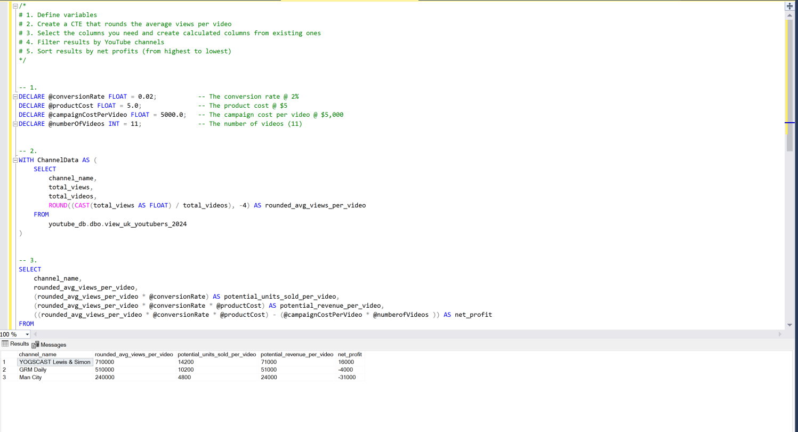

# Excel To Power BI Project
## (Top UK YouTubers 2024 Analysis)

# Table of contents

- [Objective](#objective)
- [Data Source](#data-source)
- [Stages](#stages)
- [Design](#design) 
    - [Mockup](#dashboard-mockup)
    - [Tools](#tools)
- [Development](#development)
    - [Pseudocode](#pseudocode)
    - [Data-exploration](#data-exploration-notes)
    - [Data Cleaning](#data-cleaning)
    - [Create the SQL View](#create-the-sql-view)
- [Testing](#testing-1)
    - [Data Quality Test](#data-type-check)
- [Visualization](#visualization)
    - [Results](#results)
    - [DAX Measures](#dax-measures)
- [Analysis](#analysis)
    - [Findings](#findings)
    - [Validation](#validation)
    - [Discovery](#discovery)
- [Recommendations](#recommendations)
    - [Potential ROI](#potential-roi)
    - [Potential Courses of Actions](#action-plan)
- [Conclusion](#conclution)


### Objective

- **What is the main challenge?**

The Head of Marketing needs to identify the top YouTubers in 2024 to choose the best ones for marketing campaigns for the rest of the year.

- **What is the best solution?**

Develop a dashboard that gives information on the top UK YouTubers in 2024, including their:

- Number of subscribers
- Total views
- Total videos
- Engagement metrics

This will help the marketing team decide which YouTubers to partner with for their campaigns.

### User Story

As the Head of Marketing, I want to have a dashboard that analyzes YouTube channel data in the UK.

The dashboard should help me find the top-performing channels based on metrics such as subscriber count and average views.

This will enable me to make better decisions about which YouTubers to collaborate with, ensuring that our marketing campaigns are as effective as possible.

### Data Source

**What data is required to meet our objective?**

We need data on the top UK YouTubers in 2024, including:

- Channel names
- Total subscribers
- Total views
- Total videos uploaded

**Where is the data from?**  
The data comes from an Excel file sourced from Kaggle, which can be found here.[click here to find](https://www.kaggle.com/datasets/bhavyadhingra00020/top-100-social-media-influencers-2024-countrywise?resource=download)

# Stages
- ### Design
- ### Development
- ### Testing
- ### Analysis
# Design

### Dashboard Components

- Based on the requirements, the dashboard should be designed to answer the following key questions:

1. **Top 10 YouTubers by Subscribers**  
   Display the top 10 YouTube channels with the highest number of subscribers.

2. **Top 3 Channels by Number of Videos Uploaded**  
   Which 3 YouTube channels that have uploaded the most videos.

3. **Top 3 Channels by Total Views**  
   Show the 3 channels with the highest total views.

4. **Top 3 Channels by Average Views per Video**  
   Identify the 3 channels with the highest average views per video (total views / total videos).

5. **Top 3 Channels by Views per Subscriber Ratio**  
   Show the 3 channels with the highest views-to-subscriber ratio (total views / total subscribers).

6. **Top 3 Channels by Subscriber Engagement Rate per Video**  
   Display the 3 channels with the highest engagement rate per video uploaded (could be calculated based on likes, comments, or interactions divided by the number of videos).

### Additional Notes  
These components will allow the marketing team to easily compare YouTube channels based on different performance metrics. As the analysis progresses, more questions or components may be added depending on further insights needed.
## Dashboard mockup
- What should it look like?

Some of the data visuals that may be appropriate in answering our questions include:

- Table
- Treemap
- Scorecards
- Horizontal bar chart


## Tools


|Tool      | Purpose                                                 |
|-------   |-----------                                              |
|Excel     | Exploring the data                                      |
|SQL Server| Cleaning, testing, and analyzing the data               |
|Power BI  | Visualizing the data via interactive dashboards         |
|Github    | Hosting the project documenmtation and version control   |
|Mokkup AI | Design the wireframe?mockup of the dashboard             | 

## Development

# Pseudocode
- What is the general approach in creating this solution from start to finish ?

1. Get the data
2. Explore the data in excel 
3. load the data into SQL Server
4. Clean the data with SQL
5. Test the data with SQL
6. Visualize the data in power BI
7. Generate the findings based on the insights and make recomendations
8. Document the project
9. Publish the data to Github pages and portfolio website. 

### Data exploration

At this stage, the focus is on scanning the data to identify any issues, errors, bugs, weird and corrupted characters or  inconsistencies etc before further processing.

- Upon scaanning the datasets, my initial observation and some key pionts that caught my attention include :

1. There are at least 4 columns that contain the data I need for this analysis, which signals I have everything I need from the file without needing to contact the client for any more data.
2. The first column contains the channel ID with what appears to be channel IDS, which are seperated by a @ symbol -I need to extract the channel names from this.
3. Some of the cells and header names are in different language - I need to confirm if these columns are needed, and if so I need to address them.
4. I have more data than I need, so some of these columns would need to be removed

## Data Cleaning

The goal of this stage is to refine the the dataset, ensuring it is well structured and ready for analysis, with the following considerations in mind;
- What do I expect the clean data to look like? (What should it contain? What constraints should I apply to it)

The cleaned data should meet the following criteria and constraints :

- Only relevant columns should be retained.
- All data types should be appropriate for the contents of each column.
- No column should contain null values, indicating complete data for all records.

Below is the table outlining the constraints on my cleaned dataset: 

| Property  | Description |
|-----------|-------------|
| Number of rows | 100    |
| Number of Columns | 4   |

And here is a tabular represention of the expected schema for the clean data:

|Column Name  | Data Type    | Nullable |
|-------------|--------------|----------|
|Channel_name | VARCHAR      | NO       |
|total_subscribers | INTEGER | NO       |
| total_views      | INTEGER | NO       |
| total_videos     | INTEGER | NO       |

- steps taken to clean and shape the data into the desired format

1. Removed the unnecessary columns by only selecting the ones I need 
2. Extracted Youtube channel names from the first column
3. Renamed columns using alias

**Data Trasformation**

```
/*
 1. Select the required columns
 2. Extract the channel name from the 'NOMBRE' column
*/

-- 1.
SELECT
    SUBSTRING(NOMBRE, 1, CHARINDEX('@', NOMBRE) -1) AS channel_name,  -- 2.
    total_subscribers,
    total_views,
    total_videos

FROM
    top_uk_youtubers_2024;
```

### SQL Query Output


### Create the SQL View

```
/*
	1. Create a view to store the transformation data and name the new table view_uk_youtubers_2024.
	2. Select the required columns from the top_uk_youtubers_20224.
	3. Cast the extracted channel name as VARCHAR(100).
	 
	*/

	--1
	CREATE VIEW view_uk_youtubers_2024 AS

	--2
	SELECT 
	--3
	CAST(SUBSTRING(NOMBRE, 1, CHARINDEX('@', NOMBRE) -1) AS  VARCHAR(100)) AS channel_name,
	total_subscribers,   --3
	total_views,
	total_videos
FROM 
	top_uk_youtubers_2024;
```

## Testing
- The aim here is to carry out data quality and validation checks.

Here are the data quality tests conducted:

## Row count check

```

-- Count the total number of rows (records) in the SQL view

SELECT
	COUNT(*) As row_count
FROM
	view_uk_youtubers_2024;
```
**SQL Query Output**


## Column Count Check

```
-- Count the total number of columns (fields) in the SQL view

SELECT
	COUNT(*) FROM INFORMATION_SCHEMA.COLUMNS
WHERE 
	TABLE_NAME = 'view_uk_youtubers_2024';

```
### Query Output


### Data type Check
```
/*
# Check the data types of each column from the view by checking the INFORMATION SCHEMA view
*/

SELECT 
	COLUMN_NAME,
	DATA_TYPE
FROM
	INFORMATION_SCHEMA.COLUMNS
WHERE
	TABLE_NAME = 'view_uk_youtubers_2024'; 

```
### SQL Query OutPut


## Duplicate Check

```
-- 4. Every entry in the dataset must be unique, with no duplicate records (duplicate check). 

-- 1. Check for duplicate rows in view
-- 2. Group by the channel name 
-- 3. Filter for groups with more than one row

--1.
SELECT
	channel_name, 
    COUNT(*) AS DuplicateCount
FROM
	[dbo].[view_uk_youtubers_2024]

--2
GROUP BY
	channel_name

 --3.   
HAVING 
	COUNT(*) > 1;

```
## SQL Query OutPut


## Visualization 

### Results

- A view of the Power BI dashborad


This dasboard shows the Top UK Youtubers in 2024 so far

## DAX Measures

1. Total Subscribers (M)

```Total Subscribers (M) = 
VAR million = 1000000
VAR sumOfSubscribers = SUM(view_uk_youtubers_2024[total_subscribers])
VAR totalSubscribers = DIVIDE(sumOfSubscribers,million)

RETURN totalSubscribers
```
2. Total Views (B)

```Total Views (B) = 
VAR billion = 1000000000
VAR sumOfTotalViews = SUM(view_uk_youtubers_2024[total_views])
VAR totalViews = ROUND(sumOfTotalViews / billion, 2)

RETURN totalViews
```

3. Total Videos 
```
Total Videos = 
VAR totalVideos = SUM(view_uk_youtubers_2024[total_videos])

RETURN totalVideos
```

4. Average Views Per Video(M)

```
Average Views per Video (M) = 
VAR sumOfTotalViews = SUM(view_uk_youtubers_2024[total_views])
VAR sumOfTotalVideos = SUM(view_uk_youtubers_2024[total_videos])
VAR  avgViewsPerVideo = DIVIDE(sumOfTotalViews,sumOfTotalVideos, BLANK())
VAR finalAvgViewsPerVideo = DIVIDE(avgViewsPerVideo, 1000000, BLANK())

RETURN finalAvgViewsPerVideo 
```

5. Subscriber Engagement Rate

```
Subscriber Engagement Rate = 
VAR sumOfTotalSubscribers = SUM(view_uk_youtubers_2024[total_subscribers])
VAR sumOfTotalVideos = SUM(view_uk_youtubers_2024[total_videos])
VAR subscriberEngRate = DIVIDE(sumOfTotalSubscribers, sumOfTotalVideos, BLANK())

RETURN subscriberEngRate 
```

6. Views Per Subscriber

```
Views Per Subscriber = 
VAR sumOfTotalViews = SUM(view_uk_youtubers_2024[total_views])
VAR sumOfTotalSubscribers = SUM(view_uk_youtubers_2024[total_subscribers])
VAR viewsPerSubscriber = DIVIDE(sumOfTotalViews, sumOfTotalSubscribers, BLANK())

RETURN viewsPerSubscriber 
```

## Analysis 

### Findings

- What did I find ?

- For this analysis, I focused on the questions below to get the informstion I need for our marketing client ;
- Here are key questions I need to answer for our marketing client ;

1. Who are the top 10 YouTubers with most subscribers?
2. Which 3 channels have uploaded the most videos?
3. Which 3 channels have the most views?
4. Which 3 channels have highest average views per video?
5. Which 3 channels have the highest views per subscriber ratio?
6. Which 3 channels have the highest subscriber engagement rate per video uploaded?

### 1. Who are the top 10 YouTubers with the most subscribers?

|Rank|  Channel Name          | number of subscriber(M) |
-----|------------------------|-------------------------|
| 1  | NoCopyrightSounds      |   33.60                 |
| 2  | DanTDM                 |   28.60                 |
| 3  | Dan Rhodes             |   26.60                 |
| 4  | Miss Katy              |   24.50                 |
| 5  | Mister Max             |   24.40                 |
| 6  | KSI                    |   24.10                 |
| 7  | Jelly                  |   24.50                 |
| 8  | Dua Lipa               |   23.30                 |
| 9  | Sidemen                |   21.00                 |
| 10 | Ali-A                  |   18.90                 |

### 2. Which 3 channels have uploaded the most videos ?

| Rank | Channel Name         | Number of Vidoes uploaded |
|------|----------------------|---------------------------|
| 1    | GRM Daily            |    14,696                 |
| 2    | Manchester City      |     8,248                 |
| 3    | Yogscast             |      6,435                |

### 3. Which 3 channels have the most views?

|Rank  | Channel Name         |     Total Views (B)   |
|------|----------------------|-----------------------|
| 1    | DanTDM               |   19.78               |
| 2    | Dan Rhodes           |   18.56               |
| 3    | Mister Max           |   15.97               |

### 4. Which channels have the highest average views per vidoe ?

|Rank| Channel Name      |Average Views per Video(M)   |
|----|--------------------|----------------------------|
|  1 | Mark Ronson        |  32.27                     |
|  2 | Jessie J           |  5.97                      |
|  3 | Dua Lipa           |  5.76                      |

### 5. Which 3 channels have the highest views per subscriber ratio?

|Rank| Channel Name      | Number of Views Per Subscriber|
|----|-------------------|-----------------------------|
| 1  | GRM Daily         |     1185.79                 |
| 2  | Nickelodeon       |     1061.04                 |
| 3  | Disney Junior UK  |     1031.91                 |

### 6. Which 3 channels have the highest subscriber enegagement rate per video uploaded?

|Rank| Channel Name     | Subscriber Engagement Rate   |
|----|------------------|------------------------------|
| 1  | Mark Ronson      | 343,000                      |
| 2  | Jessie J         | 110,416.67                   |
| 3  | Dua Lipa         | 104,954.95                   |

### Additional Notes :
For this analysis I prioritized analysing the metrics that are important in generating the expecgted ROI for our marketing client, which are the YouTube channels with the most :

- Subscribers
- Total views 
- Videos uploaded

### Validation 

### 1. Youtubers with the most subscribers

**calculation breakdown**

**Campaign idea = product placement** 

a. NoCopyrightSound

- Average views per video = 6.92 million 
- Product cost = $5
- Conversion Rate = 0.02 = 2%
- Potential units sold per video = 6.92 million x 2% conversion rate = 138,400 units sold
- Potential revenue per video =138,400 x $5 = $692,2000
- Campaign cost (one-time fee) = $50,000
- Net profit = $692,000 - $50,000 = $642,000

b. DanTDM

- Average views per video = 5.34 million 
- Product cost = $5
- Potential units sold per video = 5.34 million x 2% conversion rate = 106,800 units sold
- Potential revenue per vidoe = 223,000 x $5 = $5 = 1,115,000
- Campaign cost (one-time fee) = $50,000
- Net profit = $534,000 - $50,000 = $484,000

c. Dan Rhodes
- Average views per video = 11.15 million 
- Product cost = $5 
- Potential units sold per video = 11.15 million x 2% conversion rate = 223,000 units sold 
- Potential revenue per video = 223,000x$5 = $1,115,000
- Campaingn cost (onetime fee) = $50,000
- Net profit = $1,115,000 - $50,000 = $1,065,00

Best option from category : Dan Rhodes 

SQL query

```
/*

1. Define the variables
2. Createa a CTE that rounds the average views per video
3. Select the columns that are required for the analysis
4. Filter the results by the youTube channels with the highest subscriber bases
5. Order by the net_profit (from highest to Lowest)

*/

SELECT * FROM [dbo].[view_uk_youtubers_2024]

--1 
DECLARE @conversionRate FLOAT = 0.02;   -- Thecoversion rate @ 2%
DECLARE @productCost FLOAT = 5.0;      -- The product cost @ $5
DECLARE @campaignCost FLOAT = 50000;   -- The campaign cost @ $50,000

-- 2
WITH ChannelData AS(
	SELECT
		channel_name,
		total_views,
		total_videos,
		ROUND((CAST(total_views as FLOAT) / total_videos), -4) AS rounded_avg_views_per_video
	FROM
		view_uk_youtubers_2024
)

-- 3.
SELECT 
	channel_name,
	rounded_avg_views_per_video,
	(rounded_avg_views_per_video *@conversionRate) AS potential_product_sales_per_video,
	(rounded_avg_views_per_video *@conversionRate * @productCost) As potential_revenue_per_video,
	(rounded_avg_views_per_video *@conversionRate * @productCost) - @campaignCost AS Net_profit

FROM 
	ChannelData

-- 4.
WHERE channel_name IN ('NoCopyRightSounds', 'DanTDM', 'Dan Rhodes')

--5.
ORDER BY
	net_profit DESC
```


### 2. YouTubers with the most videos uploaded

**Calculation breakdown** 

**Campaign idea = sponspored video series**

a. GRM Daily
- Average Views per vidoe = 510,000 
- Product cost = $5
- Potential units sold per video = 510,000 x 2% conversion rate = 10,200 units sold
- Potential revenue per video = 10,200 x $5= $51,000
- Campaign cost (11-videos @ $5,000 each) = $55,000
- Net profit = $51,000 - $55,000 = -$4,000 (potential loss)

b. Manchester City

- Average views per video = 240,000
- Product cost = $5
- Potential units sold per video = 240,000 x 2% conversion rate = 14,800 units sold  
- Potential revenue per vidoe = 4,800 x $5 = $24,000
- Campaign cost (11-videos @ $5,000 each) = $55,000
- Net profit = $24,000 - $55,000 = -$31,000 (potential loss)

c. Yogscast

- Average views per video = 710,000
- Product cost = $5
- Potential revenue per video = 710,000 x $5 = $71,000
- Campaign cost (11-videos @ $5,000 each) = $55,000
- Net profit = $71,000 - $55,000 = $16,000 (profit)

Best option from category: Yogscast

SQL query

```
/* 
# 1. Define variables
# 2. Create a CTE that rounds the average views per video
# 3. Select the columns you need and create calculated columns from existing ones
# 4. Filter results by YouTube channels
# 5. Sort results by net profits (from highest to lowest)
*/


-- 1.
DECLARE @conversionRate FLOAT = 0.02;           -- The conversion rate @ 2%
DECLARE @productCost FLOAT = 5.0;               -- The product cost @ $5
DECLARE @campaignCostPerVideo FLOAT = 5000.0;   -- The campaign cost per video @ $5,000
DECLARE @numberOfVideos INT = 11;               -- The number of videos (11)


-- 2.
WITH ChannelData AS (
    SELECT
        channel_name,
        total_views,
        total_videos,
        ROUND((CAST(total_views AS FLOAT) / total_videos), -4) AS rounded_avg_views_per_video
    FROM
        youtube_db.dbo.view_uk_youtubers_2024
)


-- 3.
SELECT
    channel_name,
    rounded_avg_views_per_video,
    (rounded_avg_views_per_video * @conversionRate) AS potential_units_sold_per_video,
    (rounded_avg_views_per_video * @conversionRate * @productCost) AS potential_revenue_per_video,
    ((rounded_avg_views_per_video * @conversionRate * @productCost) - (@campaignCostPerVideo )) AS net_profit
FROM
    ChannelData


-- 4.
WHERE
    channel_name IN ('GRM Daily', 'Man City', 'YOGSCAST Lewis & Simon ')


-- 5.
ORDER BY
    net_profit DESC 

 ```


### 3. YouTubers with the most Views

**Calculation breakdown**

**Campaign Idea + Influncer marketing**

a. DanTDM

- Average views per video = 11.15 million
- Product cost = $5
- Potential units sold per video = 11.15 million x 2% conversion rate = 223,000 units sold
- Potential revenue per video = 106,800 x $5 = $534,000
- Campaign cost (3-month contract) = $130,000
- Net profit = $534,000 - $130,00 = $404,000

b. Dan Rhodes

- Average views per video = 11.15 million
- Product cost = $5
- Potential units sold per video = 11.15 million x 2% conversion rate = 223,000 units sold
- Potential revenue per video = 223,000 x $5 = $1,115,000
- Campaign cost (3-month contract) = $130,000
- Net profit = $1,115,000 - $130,000 = $985,000

 c. Mister Max

- Average views per video = 14.06 million
- Product cost = $5
- Potential units sold per video = 14.06 million x 2% conversion rate = 281,200 units sold
- Potential revenue per video = 281,200 x $5 = $1,406,000
- Campaign cost (3-month contract) = $130,000
- Net profit = $1,406,000 - $130,000 = $1,276,000

  Best option from category: Mister Max 

  SQL query 

```
  /*
# 1. Define variables
# 2. Create a CTE that rounds the average views per video
# 3. Select the columns you need and create calculated columns from existing ones
# 4. Filter results by YouTube channels
# 5. Sort results by net profits (from highest to lowest)
*/


-- 1.
DECLARE @conversionRate FLOAT = 0.02;        -- The conversion rate @ 2%
DECLARE @productCost FLOAT = 5.0;            -- The product cost @ $5
DECLARE @campaignCost FLOAT = 130000.0;      -- The campaign cost @ $130,000


-- 2.
WITH ChannelData AS (
    SELECT
        channel_name,
        total_views,
        total_videos,
        ROUND(CAST(total_views AS FLOAT) / total_videos, -4) AS avg_views_per_video
    FROM
        youtube_db.dbo.view_uk_youtubers_2024
)


-- 3.
SELECT
    channel_name,
    avg_views_per_video,
    (avg_views_per_video * @conversionRate) AS potential_units_sold_per_video,
    (avg_views_per_video * @conversionRate * @productCost) AS potential_revenue_per_video,
    (avg_views_per_video * @conversionRate * @productCost) - @campaignCost AS net_profit
FROM
    ChannelData


-- 4.
WHERE
    channel_name IN ('Mister Max', 'DanTDM', 'Dan Rhodes')


-- 5.
ORDER BY
    net_profit DESC;

``` 


### Discovery

- What was my obseravtion ?

1. From the analysis NoCopyrightSounds, Dn Rhodes and DanTDM are the channels with the most subscribers in the UK
2. GRM Daily, Man City, Yogscast are the channels with the most videos uploaded
3. DanTDM, Dan Rhodes and Mister Max are the channels with the most views
4. Entertainment channels are useful for broader reach, as the channels are posting consistently on their platforms and generating most engagement are focus on entertainment and music

### Recommendations

- What do I recommend based on the insights gathered ?

1. Dan Rohdes is the best YouTube channel to collaborate with if we want to maximize visibility because this channel has the most YouTube subscribers in the UK
2. Although GRM Daily, Man City and Yogcasts are regular publishers on Youtube, it may be worth considering wheather collaborating with them with the current budget caps are worth the effort, as the potential return on investments is significantly lower compared to the other channels.
3. Mister Max is the best YouTuber to collaborate with if we're interested in maximazing reach, but collaborating with DanTDM and Dan Rhodes may be better long-term options considering the fact that they both have large subscriber bases and averaging significantly high number of views.
4. The top 3 channels to form collaborations with are NoCopyrightSounds, DanTDM and Dan Rhodes based on this analysis, because they attract the most engagement on thier channels consistently.

### Potential ROI
- What ROI do we expect if we take this course of action?

1. Setting up a collaboration deal with Dan Rhodes would make the client a net profit of $1,065,000 per video
2. An influencer marketing contract with Mister Max can see the client generate a net profit of $1,276,000
3. If we go with a product placement campaign with DanTDM, this could generate the client approximately $484,000 per video. If we advance with an influncer marketing campaign deal instead, this would make the client a one-off net profit of $404,000.
4. NoCopyrightSounds could profit the client $642,000 per video too (which is worth considering)


### Action Plan

- What course of action should we take and why?

Based on our analysis, I believe the best channel to advance a long-term partnership deal with to promote the client's products is the Dan Rhodes channel.

I'll have conversations with the marketing client to forcast what they also expect from this collaboration. Once I observe we're hitting the expected milestones, I'll adavance with potential partnerships with DanTDM, Mister Max and NoCopyrightSounds channels in the future. 

- What steps do we take to implement the recommended decisions effectively?

1. Reach out to the teams behind each of the channels, starting with Dan Rhodes
2. Negotiate contracts within the budgets allocated to each marketing campaign
3. Kick off the campaigns and track each of their performances aganist the KPIs
4. Review how the campaigns have gone, gather insights and optimize based on feedback from converted customers and each channel's audiences.
